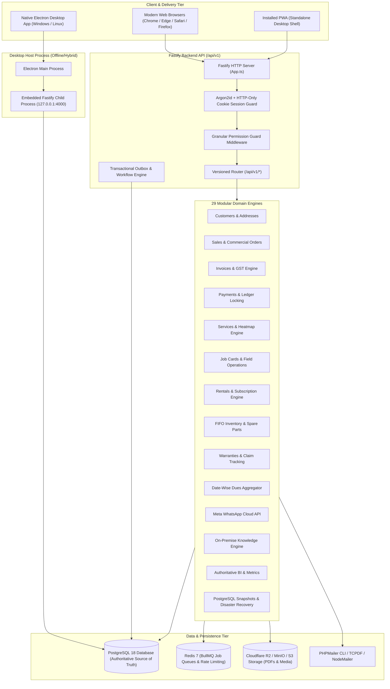
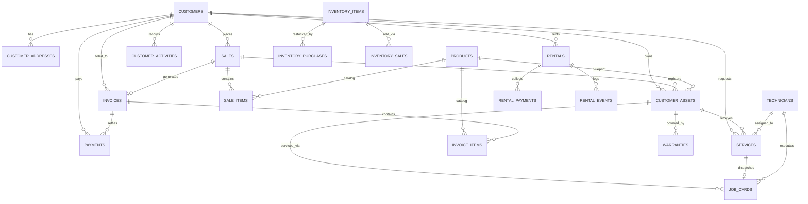
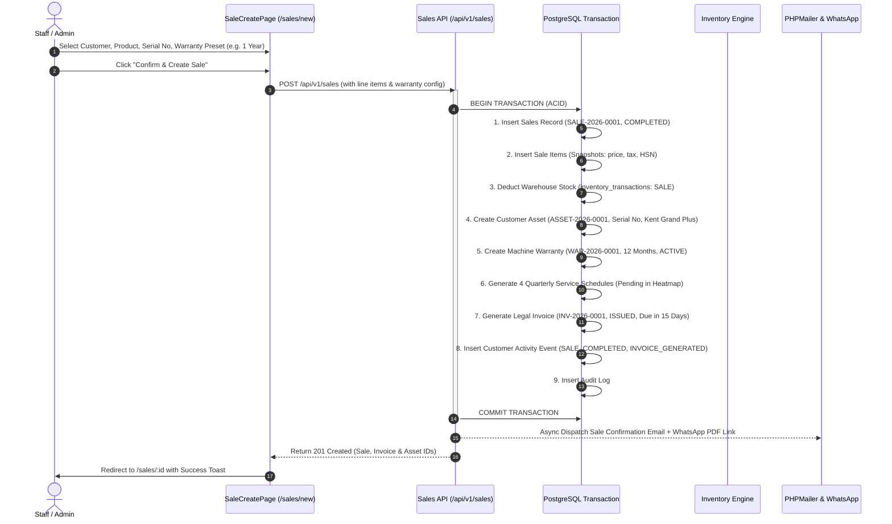
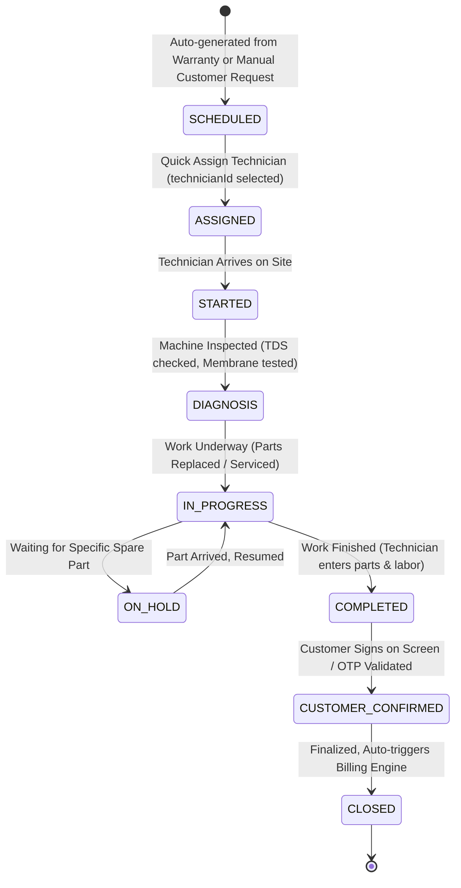
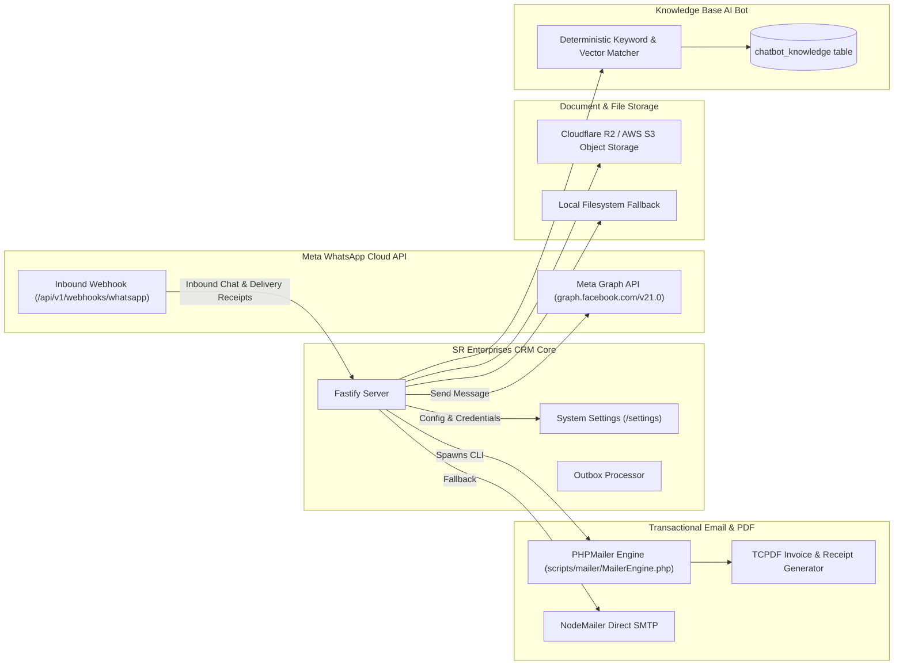

# SR ENTERPRISES CRM / SRM — COMPLETE ARCHITECTURAL & OPERATIONAL DOCUMENTATION

**Product Name:** SR Enterprises CRM (Commercial Water Purification CRM & SRM)  
**System Version:** 1.0.0 (Enterprise SaaS / Commercial Desktop / PWA)  
**Document Type:** Comprehensive Architectural, Logical, Mathematical, and Technical Blueprint  
**Primary Business Domain:** Commercial & Domestic Reverse Osmosis (RO) Water Purifier Sales, Field Service Management, Warranty Tracking, Job Cards, Inventory Accounting, Subscription Rentals, and Multi-Channel Customer Engagement.

---

# TABLE OF CONTENTS
1. [Executive Overview & SaaS Business Purpose](#1-executive-overview--saas-business-purpose)
2. [High-Level System Architecture & Monorepo Topology](#2-high-level-system-architecture--monorepo-topology)
3. [Database Schema & Relational Data Model](#3-database-schema--relational-data-model)
4. [End-to-End Logical Business Flows & Lifecycles](#4-end-to-end-logical-business-flows--lifecycles)
5. [Mathematical Calculations & Financial Formulas](#5-mathematical-calculations--financial-formulas)
6. [External Integrations & Feature Activation Mechanisms](#6-external-integrations--feature-activation-mechanisms)
7. [Comprehensive Page-to-Page Navigation & Information Routing Matrix](#7-comprehensive-page-to-page-navigation--information-routing-matrix)
8. [Role-Based Access Control (RBAC) & Security Architecture](#8-role-based-access-control-rbac--security-architecture)
9. [Complete API Contract Reference (`/api/v1`)](#9-complete-api-contract-reference-apiv1)
10. [Desktop Application & Hybrid Runtime Operations](#10-desktop-application--hybrid-runtime-operations)
11. [Background Jobs, Schedulers & Operational Runbooks](#11-background-jobs-schedulers--operational-runbooks)

---

# 1. EXECUTIVE OVERVIEW & SAAS BUSINESS PURPOSE

### 1.1 The Business Problem
Water purification businesses (specifically Reverse Osmosis systems) operate in an environment characterized by:
1. **High Post-Sale Friction**: A water purifier is not a one-time transaction. It requires mandatory scheduled maintenance (sediment filter replacement every 3-6 months, carbon block replacement, membrane replacement every 1-2 years, TDS balancing, pump repairs).
2. **Warranty vs. Billable Confusion**: Warranties cover specific internal parts (e.g., booster pump, SMPS power supply) while excluding or charging for consumables (e.g., spun filter, post-carbon). Without unified software, technicians either overcharge warranty customers or give away expensive spare parts for free.
3. **Field Workforce Tracking & Paper Job Cards**: Physical paper job cards get lost, customer signatures are untracked, and parts consumed in the field fail to deduct from warehouse stock.
4. **Subscription & Machine Rentals**: Commercial facilities (hospitals, schools, factories, offices) increasingly rent 25-100 LPH RO plants rather than buying them. Businesses struggle to track monthly rental dues, security deposits, and machine returns.
5. **Customer Attrition Due to Missed Due Dates**: When an RO membrane fouls because the dealer forgot to alert the customer about their 6-month service due date, the customer switches to a local unorganized technician.

### 1.2 The SR Enterprises Solution
SR Enterprises CRM is built around one governing engineering principle:
> **ENTER DATA ONCE &rarr; CONNECT IT TO THE RIGHT ENTITY &rarr; DERIVE AND AUTOMATE EVERYTHING.**

When an operator confirms a single machine sale:
- A permanent **Customer Profile** is established or updated.
- A serialized **Customer Asset** record is created (storing machine model, serial number, membrane, pump, and installation address).
- A legal, GST-compliant **Invoice** (`INV-YYYY-XXXX`) is automatically generated with immutable line-item snapshots.
- A **Warranty Contract** (`WAR-YYYY-XXXX`) is minted with strict expiration boundaries and coverage rules.
- A full timeline of **Periodic Maintenance Schedules** is generated (e.g., 4 quarterly services over a 2-year warranty) and instantly rendered on the **Service Heatmap** and **Date-Wise Dues Ledger**.
- Physical warehouse **Inventory** is deducted in real-time using strict FIFO cost tracking.
- An immutable **Customer Activity Event** and **Audit Log** are recorded.
- Automated **Confirmation Emails** and **WhatsApp Notifications** with PDF download links are dispatched.

---

# 2. HIGH-LEVEL SYSTEM ARCHITECTURE & MONOREPO TOPOLOGY

### 2.1 Workspace Structure
The project is architected as an industrial Turborepo monorepo managed with `pnpm` (version `9.15.4`):

```text
SR-Enterprises-CRM-Software-V1/
├── apps/
│   ├── api/                   # Backend Fastify REST API, Drizzle ORM, Background Workers
│   ├── web/                   # Frontend React 18, Vite, Tailwind CSS, TanStack Query
│   └── desktop/               # Electron Shell packaging Local Node API + Static SPA
├── packages/
│   ├── config/                # Shared ESLint and TypeScript configurations
│   ├── shared/                # Universal Constants, Date utilities, Regex, Rate Limits
│   ├── types/                 # Shared TypeScript domain contracts, Enums, DTOs
│   └── validation/            # Zod validation schemas for API inputs and frontend forms
├── scripts/
│   └── mailer/                # PHPMailer CLI engine, TCPDF Invoice/Receipt generators
├── infrastructure/            # Docker Compose production and development manifests
└── .planning/                 # Architectural specifications, domain contracts, and roadmaps
```

### 2.2 System Topology Diagram



### 2.3 Core Technologies & Design Rationale
| Layer | Technology | Engineering Rationale |
| :--- | :--- | :--- |
| **Frontend UI** | React 18, Vite, TypeScript | Ultra-fast HMR, strict type safety across forms, API clients, and domain entities. |
| **Styling & Components** | Tailwind CSS, shadcn/ui tokens, Lucide | Eliminates UI bloat; provides high-contrast, accessible, enterprise-grade dark/light styling. |
| **State Management** | TanStack Query + Zustand | Server-state caching, automatic cache invalidation on mutations, zero stale UI states. |
| **Backend Framework** | Fastify | High throughput (over 30,000 req/sec), native schema compilation, low memory footprint. |
| **Database & ORM** | PostgreSQL 18, Drizzle ORM | Deterministic SQL generation, strict TypeScript typing from schema, zero hidden runtime magic. |
| **Authentication** | Argon2id + Secure HTTP-only Cookies | Resistance against GPU cracking; immune to XSS token theft (no JWT in localStorage). |
| **Concurrency Guard** | PostgreSQL `SELECT ... FOR UPDATE` | Prevents overpayment races, double sequence issuance, and inventory negative-stock faults. |

---

# 3. DATABASE SCHEMA & RELATIONAL DATA MODEL

The database is structured to maintain strict referential integrity with foreign key cascades or restrictions where appropriate.



### 3.1 Entity Dictionary & Schemas

#### 1. Customers (`customers`) & Addresses (`customer_addresses`)
- **`customers`**: Stores individual or commercial accounts.
  - Fields: `id` (UUID PK), `customer_number` (`CUST-YYYY-XXXX`), `full_name`, `phone` (indexed, unique), `alternate_phone`, `email`, `customer_type` (`INDIVIDUAL`, `COMMERCIAL`), `company_name`, `gstin`, `status` (`ACTIVE`, `INACTIVE`, `ARCHIVED`), `customer_label` (`GOOD`, `BAD`), `notes`, `created_at`, `updated_at`.
- **`customer_addresses`**: Handles multiple addresses per customer.
  - Fields: `id`, `customer_id` (FK), `type` (`BILLING`, `SERVICE`, `BOTH`), `address_line1`, `address_line2`, `city`, `state`, `pincode`, `landmark`, `is_default`.

#### 2. Products (`products`) & Customer Assets (`customer_assets`)
- **`products`**: Master catalog of water purifiers and major components.
  - Fields: `id`, `name`, `sku` (unique), `product_type` (`RO_MACHINE`, `SPARE_PART`), `brand`, `model`, `purification_capacity`, `storage_capacity`, `technology`, `base_price`, `tax_rate_percent`, `warranty_duration_months`, `service_interval_months`, `is_active`.
- **`customer_assets`**: Physical serialized units deployed at customer locations.
  - Fields: `id`, `asset_number` (`ASSET-YYYY-XXXX`), `customer_id` (FK), `product_id` (FK), `custom_name`, `serial_number` (indexed), `installation_date`, `installation_address_id`, `status` (`ACTIVE`, `IN_SERVICE`, `REPLACED`, `DECOMMISSIONED`), `warranty_end_date`, `next_service_date`, `last_service_date`, `notes`.

#### 3. Sales (`sales`) & Sale Items (`sale_items`)
- **`sales`**: Commercial order agreements.
  - Fields: `id`, `sale_number` (`SALE-YYYY-XXXX`), `customer_id` (FK), `sale_date`, `status` (`DRAFT`, `COMPLETED`, `CANCELLED`), `subtotal`, `discount_amount`, `tax_amount`, `total_amount`, `notes`, `cancelled_at`, `cancel_reason`.
- **`sale_items`**: Line items snapshotting product details at purchase time.
  - Fields: `id`, `sale_id` (FK), `product_id` (FK), `product_name_snapshot`, `sku_snapshot`, `quantity`, `unit_price_snapshot`, `discount_amount`, `tax_rate_percent`, `tax_amount`, `line_total`, `warranty_months`, `service_interval_months`, `serial_number`, `next_service_date`.

#### 4. Invoices (`invoices`) & Invoice Items (`invoice_items`)
- **`invoices`**: Authoritative accounts receivable billing document.
  - Fields: `id`, `invoice_number` (`INV-YYYY-XXXX`), `customer_id` (FK), `sale_id` (Nullable FK), `service_id` (Nullable FK), `job_card_id` (Nullable FK), `invoice_date`, `due_date`, `subtotal`, `discount_amount`, `tax_amount`, `total_amount`, `paid_amount`, `status` (`DRAFT`, `ISSUED`, `PARTIALLY_PAID`, `PAID`, `OVERDUE`, `CANCELLED`), `pdf_url`, `notes`, `terms_and_conditions`.
- **`invoice_items`**: Frozen financial lines.
  - Fields: `id`, `invoice_id` (FK), `product_id` (Nullable FK), `item_type` (`PRODUCT`, `SERVICE`, `SPARE_PART`, `CUSTOM`), `name_snapshot`, `description_snapshot`, `quantity`, `unit_price_snapshot`, `discount_amount`, `tax_rate_percent`, `tax_amount`, `line_total`, `is_warranty_covered` (boolean).

#### 5. Payments (`payments`) & Financial Ledger
- **`payments`**: Authoritative fund receipt ledger.
  - Fields: `id`, `payment_number` (`PAY-YYYY-XXXX`), `invoice_id` (FK), `customer_id` (FK), `amount` (numeric 12,2), `payment_date`, `payment_method` (`CASH`, `UPI`, `CARD`, `BANK_TRANSFER`, `CHEQUE`, `OTHER`), `reference_number` (transaction ID / cheque no), `status` (`COMPLETED`, `PENDING`, `FAILED`, `CANCELLED`, `REFUNDED`), `receipt_number` (`REC-YYYY-XXXX`), `notes`, `recorded_by`.

#### 6. Services (`services`), Schedules (`service_schedules`) & Job Cards (`job_cards`)
- **`services`**: Service tickets / customer appointments.
  - Fields: `id`, `service_number` (`SRV-YYYY-XXXX`), `customer_id` (FK), `asset_id` (FK), `service_type` (`INSTALLATION`, `REPAIR`, `PERIODIC_MAINTENANCE`, `EMERGENCY`, `SPARE_REPLACEMENT`), `service_location` (`DOORSTEP`, `IN_SHOP`), `service_classification` (`GENERAL`, `WARRANTY`), `technician_id` (Nullable FK), `scheduled_date`, `scheduled_time_slot`, `status` (`SCHEDULED`, `ASSIGNED`, `IN_PROGRESS`, `COMPLETED`, `CANCELLED`, `OVERDUE`), `priority` (`LOW`, `NORMAL`, `HIGH`, `URGENT`), `customer_notes`, `completed_at`.
- **`service_schedules`**: Prospective maintenance timeline derived from warranty/AMC terms.
  - Fields: `id`, `asset_id` (FK), `warranty_id` (FK), `schedule_index` (1 of 4), `target_date`, `status` (`PENDING`, `SERVICE_CREATED`, `COMPLETED`, `SKIPPED`).
- **`job_cards`**: Field execution work order.
  - Fields: `id`, `job_card_number` (`JC-YYYY-XXXX`), `service_id` (FK), `customer_id` (FK), `asset_id` (FK), `technician_id` (FK), `status` (`SCHEDULED`, `ASSIGNED`, `STARTED`, `DIAGNOSIS`, `IN_PROGRESS`, `ON_HOLD`, `CANCELLED`, `COMPLETED`, `CUSTOMER_CONFIRMED`, `CLOSED`), `problem_reported`, `diagnosis_notes`, `work_performed`, `parts_used` (JSON), `labor_charge`, `parts_charge`, `total_charge`, `customer_signature_url`, `started_at`, `completed_at`.

#### 7. Rentals (`rentals`) & Rental Payments (`rental_payments`)
- **`rentals`**: Machine rental and water subscription agreements.
  - Fields: `id`, `rental_number` (`RNT-YYYY-XXXX`), `customer_id` (FK), `machine_type`, `machine_model`, `serial_number`, `capacity_lph`, `machine_condition` (`NEW`, `GOOD`, `USED_GOOD`, etc.), `rental_start_date`, `rental_end_date`, `rental_duration` (`MONTHLY`, `3_MONTHS`, `6_MONTHS`, `12_MONTHS`, `CUSTOM`), `billing_frequency` (`MONTHLY`, `QUARTERLY`, etc.), `monthly_rent`, `billing_amount`, `security_deposit`, `deposit_status` (`NOT_COLLECTED`, `COLLECTED`, `PARTIALLY_REFUNDED`, `FULLY_REFUNDED`, `FORFEITED_ADJUSTED`), `total_paid`, `outstanding_amount`, `next_due_date`, `rental_status` (`ACTIVE`, `PAYMENT_DUE`, `OVERDUE`, `RETURNED`, `CANCELLED`, `TERMINATED`), `technician_id` (FK), `installation_status`, `return_date`, `return_condition`, `damage_charges`, `deposit_adjustment`, `refund_amount`.
- **`rental_payments`**: Subscription collection ledger.
  - Fields: `id`, `rental_id` (FK), `customer_id` (FK), `amount`, `payment_date`, `payment_method`, `payment_type` (`SECURITY_DEPOSIT`, `MONTHLY_RENT`, `ADVANCE_RENT`, `DAMAGE_CHARGE`), `receipt_number`, `period_start_date`, `period_end_date`.

#### 8. Inventory Items (`inventory_items`), Purchases (`inventory_purchases`) & Sales (`inventory_sales`)
- **`inventory_items`**: Master spare parts catalog (filters, membranes, pumps, fittings, adapters).
  - Fields: `id`, `name`, `category`, `brand`, `part_number`, `purchase_price` (latest cost), `selling_price`, `current_stock`, `min_stock_level` (threshold for low-stock alert), `status` (`ACTIVE`, `INACTIVE`).
- **`inventory_purchases`**: Inward stock batches with FIFO balance tracking.
  - Fields: `id`, `purchase_number` (`PUR-YYYY-XXXX`), `item_id` (FK), `supplier_name`, `purchase_date`, `quantity`, `remaining_quantity` (decremented as sold), `purchase_price_per_unit`, `total_amount`.
- **`inventory_sales`**: Outward sales with customer linkage, locked purchase cost, and transaction profit.
  - Fields: `id`, `sale_number` (`INV-SALE-YYYY-XXXX`), `item_id` (FK), `customer_id` (FK), `sale_date`, `quantity`, `selling_price_per_unit`, `purchase_cost_per_unit` (locked from FIFO batch), `total_sale_amount`, `total_cost_amount`, `profit`, `payment_status`.

---

# 4. END-TO-END LOGICAL BUSINESS FLOWS & LIFECYCLES

### 4.1 Flow 1: Lead Ingestion & Qualification to Customer Conversion
1. **Public Submission**: A website visitor submits an inquiry on `https://srenterprises.com/contact` or initiates a WhatsApp chat.
2. **API Ingestion**: `POST /api/v1/public/inquiries` receives the payload. The backend creates an inquiry record (`INQ-YYYY-XXXX`) with status `NEW`.
3. **Realtime Broadcast**: Backend emits a Socket.IO event `inquiry:created` to all online staff. The Dashboard operational card **NEW INQUIRIES** increments.
4. **Staff Qualification**: Staff views the inquiry under `/inquiries`. They transition status `NEW` &rarr; `CONTACTED` &rarr; `QUALIFIED`.
5. **Customer Conversion**: Staff clicks **Convert to Customer**:
   - The CRM opens the `CustomerFormModal` pre-filled with the inquiry's name, phone, email, and requirements.
   - On submission, `POST /api/v1/customers` creates the customer entity.
   - The inquiry status is atomically set to `CONVERTED` with `convertedCustomerId` pointing to the new customer.
   - A timeline entry `CUSTOMER_CREATED` and `INQUIRY_CONVERTED` is added to the customer activity log.

---

### 4.2 Flow 2: Machine Sale to Warranty & Maintenance Pipeline



---

### 4.3 Flow 3: Service Ticket & Field Job Card Operations



1. **Scheduling**: A service is scheduled via the Service Heatmap or automatically from the warranty cycle.
2. **Technician Dispatch**: When the service manager assigns a technician:
   - System updates `status` to `ASSIGNED`.
   - Generates or binds `JobCard` (`JC-YYYY-XXXX`).
   - Automatically fires a **WhatsApp dispatch message** to the technician's mobile with the customer's full address, Google Maps link, and reported problem.
3. **Execution**: The technician moves the job card through its lifecycle (`STARTED` &rarr; `DIAGNOSIS` &rarr; `IN_PROGRESS` &rarr; `COMPLETED`).
4. **Closure & Signature**: Technician uploads customer confirmation and signs off. Status becomes `CLOSED`.

---

### 4.4 Flow 4: Service Billing & Automatic Inventory Movement
When a Job Card is marked `COMPLETED` or `CLOSED`, the **Service Billing Engine** takes over:
1. **Warranty Evaluation**: The engine checks `warranties` for the linked `assetId`.
   - If `warranty.status === 'ACTIVE'` and the current date is before `end_date`:
     - Standard warranty spare parts have `unitPrice: 0.00` and `isWarrantyCovered: true`.
     - Standard technician labor charge is ₹0.
   - If warranty is expired or part is non-covered:
     - Part is priced at standard catalog selling price.
     - Labor and doorstep service fees are added.
2. **Stock Consumption**: For every physical spare part consumed, an atomic inventory transaction is created:
   - `inventory_transactions` record inserted (`type: 'SALE'`, `referenceType: 'JOB_CARD'`).
   - `inventory_items.current_stock` decremented.
3. **Invoice Generation**: An invoice (`INV-YYYY-XXXX`) is issued under `/invoices`. If total amount is ₹0 (100% warranty covered), invoice status is automatically marked `PAID`. If non-zero, it enters `ISSUED` status and shows up in Accounts Receivable.

---

### 4.5 Flow 5: Payment Processing & Accounts Receivable Reconciliation
1. **Invoice State**: Invoice has `totalAmount = ₹16,500`, `paidAmount = ₹0`, status `ISSUED`.
2. **Collection**: Customer pays ₹10,000 via UPI QR Code.
3. **Pessimistic Concurrency Lock**:
   - Backend opens ACID transaction with `SELECT ... FOR UPDATE` on the invoice row.
   - Computes: $\text{CurrentPaid} = \sum \text{CompletedPayments}$.
   - Verifies: $\text{PaymentAmount} \le (\text{InvoiceTotal} - \text{CurrentPaid})$.
4. **Recording**:
   - Inserts `payments` record (`PAY-2026-0001`, `REC-2026-0001`, ₹10,000, `UPI`).
   - Updates `invoices`: `paid_amount = ₹10,000`, `status = 'PARTIALLY_PAID'`.
   - Updates customer summary: Outstanding reduced by ₹10,000.
5. **Second Payment**: Customer pays remaining ₹6,500 in Cash:
   - Inserts second `payments` record.
   - Invoices updated: `paid_amount = ₹16,500`, `status = 'PAID'`.
   - Any linked pending payment reminders are automatically marked `COMPLETED`.

---

### 4.6 Flow 6: RO Machine Rental & Subscription Lifecycle
1. **Agreement**: Commercial client rents a 50 LPH RO Plant at ₹2,500/month with a ₹5,000 Security Deposit.
2. **Creation**: System issues Rental Agreement `RNT-2026-0001`:
   - Records serial number, condition (`GOOD`), billing frequency (`MONTHLY`).
   - Initial payment collected: ₹5,000 (Deposit) + ₹2,500 (First Month Rent) = ₹7,500.
   - `nextDueDate` set to 30 days in the future.
3. **Monthly Cycle**: Every month, the rental appears in `/dues` on its `nextDueDate`. Staff clicks **Collect Rent** &rarr; records ₹2,500 &rarr; `nextDueDate` advances by 1 month.
4. **Decommissioning & Return**:
   - Client terminates rental after 1 year.
   - Staff initiates **Machine Return**:
     - Inspection records machine condition (`USED_GOOD`).
     - Damage deductions (e.g. ₹500 for broken tap).
     - Net refund calculated: $\text{Deposit (₹5000)} - \text{Damage (₹500)} = \text{₹4,500 Refund}$.
     - Deposit status transitions to `FULLY_REFUNDED` or `FORFEITED_ADJUSTED`.
     - Agreement status becomes `RETURNED`. Machine serial is released back to available inventory.

---

# 5. MATHEMATICAL CALCULATIONS & FINANCIAL FORMULAS

### 5.1 Deterministic Banker's Rounding
JavaScript IEEE-754 floating point operations suffer from precision drift (e.g. `0.1 + 0.2 = 0.30000000000000004`). In SR Enterprises CRM, all money values are normalized using 2-decimal banker's epsilon rounding:

$$\text{roundToTwo}(v) = \frac{\lfloor (v + \epsilon) \times 100 + 0.5 \rfloor}{100} \quad \text{where } \epsilon = \text{Number.EPSILON}$$

In code (`invoices.calculator.ts`, `sales.calculator.ts`):
```typescript
export function roundToTwo(value: number): number {
  return Math.round((value + Number.EPSILON) * 100) / 100;
}
export function formatMoney(value: number): string {
  return roundToTwo(value).toFixed(2);
}
```

---

### 5.2 Line Item & Invoice Financial Formulas

```text
┌────────────────────────────────────────────────────────────────────────┐
│ Line Level Calculations:                                              │
│                                                                        │
│ 1. Line Subtotal     = Quantity × Unit Price                           │
│ 2. Line Discount     = min(Line Subtotal, max(0, Discount Amount))     │
│ 3. Line Taxable      = max(0, Line Subtotal - Line Discount)           │
│ 4. Line Tax          = roundToTwo(Line Taxable × (Tax Rate % / 100))   │
│ 5. Line Total        = roundToTwo(Line Taxable + Line Tax)             │
├────────────────────────────────────────────────────────────────────────┤
│ Document Level Calculations:                                           │
│                                                                        │
│ 6. Invoice Subtotal  = ∑ Line Subtotals                                │
│ 7. Total Discount    = roundToTwo(∑ Line Discounts + Document Discount)│
│ 8. Invoice Taxable   = max(0, roundToTwo(Invoice Subtotal - Total Disc))│
│ 9. Invoice Total Tax = ∑ Line Taxes                                    │
│ 10. Grand Total      = max(0, roundToTwo(Invoice Taxable + Total Tax)) │
└────────────────────────────────────────────────────────────────────────┘
```

#### GST Split Calculation (Intra-State vs Inter-State)
- If Customer State == Business State (Default: Maharashtra / Code 27):
  $$\text{CGST Rate} = \frac{\text{Tax Rate}}{2}, \quad \text{CGST Amount} = \text{roundToTwo}\left(\frac{\text{Line Tax}}{2}\right)$$
  $$\text{SGST Rate} = \frac{\text{Tax Rate}}{2}, \quad \text{SGST Amount} = \text{roundToTwo}\left(\frac{\text{Line Tax}}{2}\right)$$
- If Customer State != Business State:
  $$\text{IGST Rate} = \text{Tax Rate}, \quad \text{IGST Amount} = \text{Line Tax}$$

---

### 5.3 FIFO Inventory Batch Costing & Profit Ledger
When stock is sold, unit profit is **not** calculated against the static catalog price. It is calculated against the actual FIFO purchase cost of the batch consumed:

1. Let $Q_{\text{sold}}$ be quantity to sell, and available purchase batches $B_1, B_2, \dots, B_n$ ordered by `purchase_date ASC`:
2. For each batch $B_i$:
   $$\text{Take}_i = \min(B_i.\text{remainingQuantity}, Q_{\text{needed}})$$
   $$\text{Cost}_i = \text{Take}_i \times B_i.\text{purchasePricePerUnit}$$
   $$B_i.\text{remainingQuantity} \leftarrow B_i.\text{remainingQuantity} - \text{Take}_i$$
   $$Q_{\text{needed}} \leftarrow Q_{\text{needed}} - \text{Take}_i$$
3. Weighted Transaction Purchase Cost:
   $$\text{Total Cost Amount} = \sum \text{Cost}_i$$
   $$\text{Purchase Cost Per Unit} = \text{roundToTwo}\left(\frac{\text{Total Cost Amount}}{Q_{\text{sold}}}\right)$$
4. Realized Commercial Profit:
   $$\text{Total Sale Amount} = Q_{\text{sold}} \times \text{Selling Price Per Unit}$$
   $$\text{Profit} = \text{Total Sale Amount} - \text{Total Cost Amount}$$
   $$\text{Profit Margin } \% = \begin{cases} \left(\frac{\text{Profit}}{\text{Total Sale Amount}}\right) \times 100 & \text{if Total Sale} > 0 \\ 0\% & \text{otherwise} \end{cases}$$

---

### 5.4 Accounts Receivable & Overdue Aging Math
- **Invoice Balance**:
  $$\text{Invoice Outstanding} = \max(0, \text{Invoice.totalAmount} - \sum \text{CompletedPayments})$$
- **Invoice Status Determination**:
  $$\text{Status} = \begin{cases} 
  \text{PAID} & \text{if Outstanding } \le 0.001 \\
  \text{PARTIALLY\_PAID} & \text{if Outstanding } > 0 \land \text{Paid} > 0 \\
  \text{OVERDUE} & \text{if Paid} = 0 \land \text{CurrentDate} > \text{DueDate} \\
  \text{ISSUED} & \text{otherwise}
  \end{cases}$$
- **Aging Buckets**:
  - `0 - 30 Days`: $\text{CurrentDate} - \text{DueDate} \in [0, 30]$
  - `31 - 60 Days`: $\text{CurrentDate} - \text{DueDate} \in [31, 60]$
  - `61 - 90 Days`: $\text{CurrentDate} - \text{DueDate} \in [61, 90]$
  - `90+ Days`: $\text{CurrentDate} - \text{DueDate} > 90$

---

### 5.5 Service Interval & Schedule Generation Formula
Given:
- Warranty Duration in Months: $W_m$ (e.g. 24 months)
- Service Interval in Months: $S_m$ (e.g. 6 months)
- Installation Date: $D_{\text{install}}$

$$\text{Total Scheduled Services } N = \left\lfloor \frac{W_m}{S_m} \right\rfloor$$
$$\text{Scheduled Target Date}_i = D_{\text{install}} + (i \times S_m \text{ months}) \quad \text{for } i \in \{1, 2, \dots, N\}$$

---

### 5.6 Sequence Number Generation Math
Document identifiers are generated atomically in PostgreSQL using an upsert counter with optional yearly reset:
```sql
INSERT INTO business_sequences (name, prefix, current_val, padding, year_reset, current_year, updated_at)
VALUES ($1, $2, 1, $3, $4, $5, NOW())
ON CONFLICT (name) DO UPDATE SET
  current_val = CASE
    WHEN business_sequences.year_reset = true AND business_sequences.current_year < $5 THEN 1
    ELSE business_sequences.current_val + 1
  END,
  prefix = $2,
  current_year = $5,
  updated_at = NOW()
RETURNING current_val, current_year, prefix, padding;
```
Formatted String:
$$\text{DocumentID} = \text{Prefix} + \text{"-"} + \text{Year} + \text{"-"} + \text{PadZeroes}(\text{current\_val}, \text{padding})$$
Example: `INV-2026-0001`

---

# 6. EXTERNAL INTEGRATIONS & FEATURE ACTIVATION MECHANISMS



### 6.1 Meta WhatsApp Business Cloud API Integration
1. **Activation**:
   - Configured via server environment variables:
     - `WHATSAPP_PHONE_NUMBER_ID`: Unique phone number ID from Meta Developer Portal.
     - `WHATSAPP_ACCESS_TOKEN`: Permanent System User Access Token with `whatsapp_business_messaging` permissions.
     - `WHATSAPP_API_VERSION`: Default `v21.0`.
     - `WHATSAPP_WEBHOOK_APP_SECRET`: App Secret for HMAC-SHA256 signature verification.
   - If credentials are not set, the provider automatically falls back to an **interactive simulation provider**, allowing local testing without runtime crashes.
2. **Outbound Messaging**:
   - **Text Messages**: Direct customer chat from `/whatsapp`.
   - **Template Messages**: High-priority notifications that bypass the 24-hour customer service window:
     - `invoice_issued`: Dispatches invoice number, total amount, due date, and public PDF link.
     - `payment_receipt`: Dispatches payment reference, amount received, and remaining balance.
     - `service_reminder`: Alerts customer that RO service is due in 3 days.
     - `job_assigned`: Dispatches technician contact details to customer, and customer address to technician.
3. **Inbound Webhook Ingestion**:
   - Endpoint: `/api/v1/webhooks/whatsapp`.
   - Security: Verifies `x-hub-signature-256` header using HMAC SHA-256 with `WHATSAPP_WEBHOOK_APP_SECRET`.
   - Parses customer replies, matches phone number to existing customer, and inserts into `whatsapp_messages` table. Socket.IO broadcasts the message to the frontend WhatsApp Hub in real time.

---

### 6.2 Transactional Email & PDF Generation Engine
1. **Dual-Engine Architecture**:
   - **Primary Engine**: High-performance PHPMailer CLI (`scripts/mailer/MailerEngine.php`) utilizing `PdfInvoiceGenerator.php` and `PdfReceiptGenerator.php`.
   - **Fallback Engine**: Native Node.js `NodeMailer` using SMTP configuration from `system_settings` or `.env`.
2. **How Activation Works**:
   - When a sale is confirmed, invoice issued, or payment recorded, `PhpMailerService.dispatch()` is invoked.
   - It checks for the existence of `scripts/mailer/dispatch_email.php`.
   - If present and PHP CLI is available, it executes a non-blocking child process with JSON payload:
     ```bash
     php scripts/mailer/dispatch_email.php --payload='{"eventType":"SALE_CONFIRMATION", ...}'
     ```
   - The script renders a pixel-perfect, GST-compliant PDF invoice (with official SR Enterprises header, bank QR code, terms, and tax breakdown) and attaches it to the email.
   - If PHP is absent, the Node.js `emailService` renders HTML email templates and sends them directly via SMTP.

---

### 6.3 Trainable On-Premise Knowledge Chatbot Engine
1. **Philosophy**:
   - 100% database-driven, deterministic, zero-external-API cost, and offline-capable.
   - No external OpenAI/Gemini API calls required for customer support lookup.
2. **Activation & Operation**:
   - Activated via `Settings &rarr; AI Chatbot` (`/settings` tab `chatbot`).
   - Administrators enter Q&A pairs with categories (`PRICING`, `TECHNICAL`, `WARRANTY`, `SERVICE`, `GENERAL`).
   - When a user asks a question in the chatbot widget:
     - The query is tokenized, stripped of Indian/English stop words (`what`, `is`, `ka`, `ki`, `kya`, `kare`), and normalized.
     - Performs SQL keyword scoring across `question`, `title`, `keywords`, and `answer`.
     - Returns the exact verified response. If no confidence match is found, returns the safe company support fallback:
       > *"I don't have enough information in my current knowledge base. Please contact SR Enterprises at +91 73850 59197 or srenterprises02015@gmail.com."*

---

### 6.4 Object Storage (Cloudflare R2 / S3 / Local)
1. **Activation**:
   - Configured via `STORAGE_PROVIDER`: `S3_R2` or `LOCAL`.
   - S3 credentials: `S3_ENDPOINT`, `S3_ACCESS_KEY_ID`, `S3_SECRET_ACCESS_KEY`, `S3_BUCKET_NAME`.
2. **Document Lifecycle**:
   - Files uploaded (customer KYC, invoice PDFs, technician completion photos, job card signatures) are validated for MIME type and size (&le; 10MB).
   - Stored in object storage with unique cryptographic hashes: `invoices/2026/INV-2026-0001.pdf`.
   - Database stores the file key, size, and metadata in `documents` table.

---

### 6.5 Automated Database Backup & Disaster Recovery Engine
1. **Activation**:
   - Configured in `Settings &rarr; Backup & Recovery` or scheduled via BullMQ / OS cron.
2. **Mechanisms**:
   - **PostgreSQL**: Executes `pg_dump --clean --if-exists --no-owner` creating timestamped `.sql` or compressed `.tar.gz` dumps.
   - Stored locally in `storagePaths.backupsDir` and mirrored to remote S3 bucket if configured.
   - Restoration: Verified restore test script validates schema integrity and row counts before swapping tables.

---

# 7. COMPREHENSIVE PAGE-TO-PAGE NAVIGATION & INFORMATION ROUTING MATRIX

This table documents **every page interaction in the CRM**: what screen triggers it, what payload is transferred, which API is called, and where the user lands next.

| # | Source Page & Action | Trigger Element | Payload / State Passed | API Endpoint Called | Destination Page & Effect |
| :--- | :--- | :--- | :--- | :--- | :--- |
| **1** | `/login` &bull; Login Submit | Form Submit Button | `{ username, password, challengeId, captcha }` | `POST /api/v1/auth/login` | Redirects to `/dashboard` (or previously requested protected URL via `location.state.from`). |
| **2** | `/dashboard` &bull; Click "Services Due Today" | Operational Card 1 | None (Route transition) | `GET /api/v1/services?status=SCHEDULED&date=today` | Navigates to `/services` with due date filter preset to Today. |
| **3** | `/dashboard` &bull; Click "New Inquiries" | Operational Card 2 | None | `GET /api/v1/inquiries?status=NEW` | Navigates to `/inquiries` with unread filter active. |
| **4** | `/dashboard` &bull; Click "Warranties Expiring" | Operational Card 3 | None | `GET /api/v1/warranties?status=EXPIRING_SOON` | Navigates to `/warranty` filtered by 30-day expiration window. |
| **5** | `/dashboard` &bull; Click "Payments Due" | Operational Card 4 | None | `GET /api/v1/payments?status=PENDING` | Navigates to `/payments` with outstanding filter. |
| **6** | `/dashboard` &bull; Click "Technicians on Duty" | Operational Card 5 | None | `GET /api/v1/technicians` | Navigates to `/technicians` roster. |
| **7** | `/dashboard` &bull; Schedule Item Click | Row in Today's Schedule | Service ID or Job Card ID | `GET /api/v1/services/:id` | Opens `/services/:id` or `/job-cards/:id`. |
| **8** | `/customers` &bull; Add Customer | Top Action "+ Add Customer" | Form data: Name, Phone, Address, Type | `POST /api/v1/customers` | Closes modal, refreshes table, auto-navigates to new `/customers/:id`. |
| **9** | `/customers` &bull; Row Click | Table Row / Eye Icon | Customer ID | `GET /api/v1/customers/:id` | Navigates to `/customers/:id` (Customer Profile). |
| **10** | `/customers/:id` &bull; "+ Create Sale" | Header Action / Sales Tab | Query param: `?customerId=:id` | None (Client routing) | Navigates to `/sales/new?customerId=:id` with customer pre-selected. |
| **11** | `/customers/:id` &bull; "+ Schedule Service" | Overview / Services Tab | Asset ID, Customer ID | None (Modal state) | Opens `ScheduleServiceModal`; on submit calls `POST /api/v1/services`. |
| **12** | `/customers/:id` &bull; "+ Record Payment" | Financial Card / Invoices Tab | Invoice ID, Customer ID | None (Modal state) | Opens `RecordPaymentModal`; on submit calls `POST /api/v1/payments`. |
| **13** | `/customers/:id` &bull; Invoice Row Click | Invoice Table Item | Invoice ID | None | Navigates to `/invoices/:id`. |
| **14** | `/customers/:id` &bull; Sale Row Click | Sales History Table Item | Sale ID | None | Navigates to `/sales/:id`. |
| **15** | `/customers/:id` &bull; "+ Create Rental" | Rentals Tab Action | Query param: `?customerId=:id` | None | Navigates to `/rent` with `RentalCreateModal` opened for this customer. |
| **16** | `/sales/new` &bull; Submit Sale | "Confirm & Create Sale" Button | Items, Pricing, Serial Numbers, Warranty | `POST /api/v1/sales` | Navigates to `/sales/:id` (Sale Detail Page) with success toast. |
| **17** | `/sales/:id` &bull; View Invoice | "View Invoice" Button | Invoice ID | None | Navigates to `/invoices/:invoiceId`. |
| **18** | `/sales/:id` &bull; Cancel Sale | "Cancel Sale" Action | `{ reason }` | `POST /api/v1/sales/:id/cancel` | Stays on page; updates status badge to `CANCELLED`, reverses stock. |
| **19** | `/invoices` &bull; Row Click | Table Row | Invoice ID | `GET /api/v1/invoices/:id` | Navigates to `/invoices/:id`. |
| **20** | `/invoices/:id` &bull; Record Payment | "Record Payment" Button | Invoice ID, Balance | None (Modal) | Opens `RecordPaymentModal`; on success refreshes balance and shows receipt. |
| **21** | `/invoices/:id` &bull; Send WhatsApp | "WhatsApp Share" Button | Customer Phone, Invoice Link | Window Open / WhatsApp API | Opens WhatsApp Web or executes API dispatch with invoice PDF URL. |
| **22** | `/invoices/:id` &bull; Send Due Email | "Send Due Notice" Button | Invoice ID | `POST /api/v1/invoices/:id/send-due-mail` | Triggers PHPMailer CLI / NodeMailer; displays toast confirmation. |
| **23** | `/invoices/:id` &bull; Public Link | "Public View" Icon | Invoice ID | None | Navigates to `/invoice/view/:id` (Unauthenticated customer view). |
| **24** | `/services` &bull; Heatmap Cell Click | Heatmap Date Square | Date string `YYYY-MM-DD` | Client filter state | Filters service list below heatmap to show only tickets for that date. |
| **25** | `/services` &bull; Row Click | Table Row | Service ID | `GET /api/v1/services/:id` | Navigates to `/services/:id`. |
| **26** | `/services/:id` &bull; Quick Assign | "Assign Technician" Button | Technician ID | `POST /api/v1/services/:id/assign` | Assigns technician, generates job card, updates UI. |
| **27** | `/services/:id` &bull; Notify Technician | "Notify WhatsApp" Button | Service ID | `POST /api/v1/services/:id/notify-technician-whatsapp` | Dispatches WhatsApp message to technician with customer address and map. |
| **28** | `/services/:id` &bull; Complete Service | "Complete Service" Button | Parts used, charges, notes | `POST /api/v1/services/:id/complete` | Marks service complete; opens Invoice Generation prompt. |
| **29** | `/services/:id` &bull; Generate Invoice | "Create Invoice" Action | Job Card ID | `POST /api/v1/job-cards/:id/invoice` | Generates invoice in `/invoices`, deducts parts from stock, redirects to invoice. |
| **30** | `/job-cards` &bull; Row Click | Table Row | Job Card ID | `GET /api/v1/job-cards/:id` | Navigates to `/job-cards/:id`. |
| **31** | `/job-cards/:id` &bull; Start / Hold / Resume | Lifecycle Action Buttons | Action: `start`, `hold`, `resume` | `POST /api/v1/job-cards/:id/actions` | Transitions state machine; reflects immediately in timeline. |
| **32** | `/dues` &bull; Date Picker | Calendar Control | Selected date `YYYY-MM-DD` | `GET /api/v1/dues?date=YYYY-MM-DD` | Aggregates all services, doorstep visits, rental dues, and reminders for that date. |
| **33** | `/rent` &bull; "+ New Agreement" | Top Header Button | Form data: Customer, Machine, Rent, Deposit | `POST /api/v1/rentals` | Creates rental agreement; prompts to collect initial security deposit. |
| **34** | `/rent` &bull; Collect Rent | Row Action "Collect" | Rental ID, Month | None (Modal) | Opens `RentalPaymentModal`; calls `POST /api/v1/rentals/:id/payments`. |
| **35** | `/rent` &bull; Return Machine | Row Action "Return" | Rental ID | None (Modal) | Opens `RentalReturnModal`; records condition, damage charges, computes deposit refund. |
| **36** | `/inventory` &bull; Record Purchase | "+ Record Purchase" Button | Item, Supplier, Quantity, Unit Price | `POST /api/v1/inventory-management/purchases` | Adds inward stock batch; updates item available stock. |
| **37** | `/inventory` &bull; Record Sale | "+ Record Sale" Button | Item, Customer, Quantity, Selling Price | `POST /api/v1/inventory-management/sales` | Deducts stock using FIFO batch cost; locks profit in profit ledger. |
| **38** | `/whatsapp` &bull; Select Conversation | Left List Item Click | Conversation ID | `GET /api/v1/whatsapp/conversations/:id/messages` | Loads chat history in right pane; marks unread messages as read. |
| **39** | `/whatsapp` &bull; Send Message | Chat Input + Enter | `{ conversationId, content }` | `POST /api/v1/whatsapp/messages` | Sends message via Meta Cloud API; renders bubble with single checkmark. |
| **40** | `/settings` &bull; Switch Tab | Navigation Pill Click | Tab ID (e.g. `numbering`) | None (Client State) | Renders respective configuration section (e.g. Numbering, Chatbot, Backup). |

---

# 8. ROLE-BASED ACCESS CONTROL (RBAC) & SECURITY ARCHITECTURE

### 8.1 Roles Definition
The CRM enforces strict four-tier Role-Based Access Control:
1. **Super Admin**: Complete master control across all tenants, financial settings, audit trails, user administration, permanent deletion, and disaster recovery.
2. **Admin**: Operational manager. Full access to customer records, sales, invoices, field services, technicians, inventory, and reports. Cannot alter system-level database backups or super-admin credentials.
3. **Staff (Front Desk / Operator)**: Creates customers, drafts sales, schedules services, registers website inquiries, records payments, and issues reminders.
4. **Technician**: Mobile/Field worker. Restricted strictly to assigned services, assigned job cards, recording work logs, and checking spare parts compatibility. **No access to customer financial ledgers, system settings, or overall business profit metrics.**

### 8.2 Granular Permissions Matrix

| Permission Key | Super Admin | Admin | Staff | Technician | Functional Scope |
| :--- | :---: | :---: | :---: | :---: | :--- |
| `customers.view` | &check; | &check; | &check; | &check; (Assigned only) | View customer directories and contact cards |
| `customers.create` | &check; | &check; | &check; | &cross; | Register new customer accounts |
| `customers.update` | &check; | &check; | &check; | &cross; | Modify addresses, phone numbers, notes |
| `customers.archive` | &check; | &check; | &cross; | &cross; | Soft delete / archive customer entities |
| `sales.view` | &check; | &check; | &check; | &cross; | View commercial sales orders and history |
| `sales.create` | &check; | &check; | &check; | &cross; | Issue new product/machine sales |
| `sales.cancel` | &check; | &check; | &cross; | &cross; | Cancel sales and trigger stock reversal |
| `invoices.view` | &check; | &check; | &check; | &cross; | Access invoices, tax breakdowns, PDFs |
| `invoices.create` | &check; | &check; | &check; | &cross; | Generate official legal invoices |
| `invoices.cancel` | &check; | &check; | &cross; | &cross; | Invalidate issued invoices with audit reason |
| `payments.view` | &check; | &check; | &check; | &cross; | View accounts receivable and collection ledger |
| `payments.create` | &check; | &check; | &check; | &cross; | Record payment receipts and UPI transactions |
| `payments.reverse` | &check; | &check; | &cross; | &cross; | Cancel/reverse payments with balance adjustment |
| `services.view` | &check; | &check; | &check; | &check; | View service tickets and maintenance schedules |
| `services.create` | &check; | &check; | &check; | &cross; | Create service appointments |
| `services.assign` | &check; | &check; | &cross; | &cross; | Assign technicians to work orders |
| `services.complete` | &check; | &check; | &cross; | &check; | Mark service complete and sign off job cards |
| `rentals.view` | &check; | &check; | &check; | &cross; | Access machine subscription agreements |
| `rentals.manage` | &check; | &check; | &cross; | &cross; | Create agreements, process machine returns |
| `inventory.view` | &check; | &check; | &check; | &check; (Stock levels only) | Inspect spare parts catalogue |
| `inventory.manage` | &check; | &check; | &cross; | &cross; | Record purchases, adjust stock, view profit ledger |
| `reports.view` | &check; | &check; | &cross; | &cross; | View business analytics, gross revenue, margins |
| `settings.manage` | &check; | &cross; | &cross; | &cross; | Change company GST, sequences, backup schedules |

---

# 9. COMPLETE API CONTRACT REFERENCE (`/api/v1`)

All endpoints are hosted under prefix `/api/v1` and return standard JSON envelope structures:
```json
{
  "success": true,
  "data": { ... },
  "message": "Optional human-readable confirmation"
}
```
Error Envelope:
```json
{
  "success": false,
  "error": {
    "code": "VALIDATION_ERROR",
    "message": "Field 'phone' must be at least 10 digits"
  }
}
```

### Key API Endpoints Catalog

#### Authentication & System
- `GET /api/v1/auth/captcha` &bull; Generates short-lived session CAPTCHA SVG and challenge ID.
- `POST /api/v1/auth/login` &bull; Authenticates user with Argon2id password hash, checks lockout, sets secure cookie.
- `POST /api/v1/auth/logout` &bull; Invalidates session cookie and server session cache.
- `GET /api/v1/auth/me` &bull; Returns active user profile and permission list.
- `GET /api/v1/system/ping` &bull; Connectivity probe returning server timestamp and database status.

#### Customers & Assets
- `GET /api/v1/customers` &bull; Paginated customer list with search, status filters, and sorting.
- `POST /api/v1/customers` &bull; Create new customer with billing/service addresses.
- `GET /api/v1/customers/:id` &bull; Complete customer profile with assets, sales, invoices, and service history.
- `PATCH /api/v1/customers/:id` &bull; Update customer details.
- `POST /api/v1/customers/:id/archive` &bull; Soft-archive customer.
- `GET /api/v1/assets` &bull; Search customer assets by brand, model, serial number.
- `GET /api/v1/customers/:id/assets` &bull; List serialized assets owned by customer.

#### Sales & Commercial
- `GET /api/v1/sales` &bull; Paginated sales orders directory.
- `POST /api/v1/sales` &bull; Create sale order with line items, tax rate, warranty terms, and stock deduction.
- `GET /api/v1/sales/:id` &bull; Single sale details with linked invoice and assets.
- `POST /api/v1/sales/:id/confirm` &bull; Confirm draft sale, minting invoice, assets, and service schedule.
- `POST /api/v1/sales/:id/cancel` &bull; Cancel sale, restoring inventory stock.

#### Invoices & Payments
- `GET /api/v1/invoices` &bull; Paginated tax invoices with payment status and aging indicators.
- `GET /api/v1/invoices/:id` &bull; Single invoice with snapshot line items and payment transaction history.
- `POST /api/v1/invoices` &bull; Create standalone invoice.
- `POST /api/v1/invoices/:id/cancel` &bull; Cancel issued invoice preserving historical records.
- `GET /api/v1/payments` &bull; Master collection ledger.
- `POST /api/v1/payments` &bull; Record payment with row-level lock and overpayment prevention.
- `POST /api/v1/payments/:id/cancel` &bull; Cancel payment and atomically restore invoice receivable balance.
- `GET /api/v1/invoices/:id/balance` &bull; Realtime calculation of invoice outstanding balance.

#### Services & Field Operations
- `GET /api/v1/services` &bull; Service tickets list with heatmap aggregation query parameters.
- `POST /api/v1/services` &bull; Schedule service appointment.
- `GET /api/v1/services/:id` &bull; Service ticket details, technician assignment, and job card.
- `POST /api/v1/services/:id/assign` &bull; Assign technician and dispatch WhatsApp alert.
- `POST /api/v1/services/:id/complete` &bull; Record service completion and parts replaced.
- `GET /api/v1/job-cards/:id` &bull; Work order details, diagnostics, labor charges.
- `POST /api/v1/job-cards/:id/actions` &bull; State machine transition (`start`, `hold`, `resume`, `cancel`).
- `POST /api/v1/job-cards/:id/invoice` &bull; Convert completed job card into billable invoice.

#### Rentals & Subscriptions
- `GET /api/v1/rentals` &bull; Rental agreements directory.
- `POST /api/v1/rentals` &bull; Register rental agreement and equipment deployment.
- `POST /api/v1/rentals/:id/payments` &bull; Collect recurring monthly rental payment.
- `POST /api/v1/rentals/:id/return` &bull; Process machine return, assess damage charges, calculate deposit refund.

#### Date-Wise Dues & Operations
- `GET /api/v1/dues` &bull; Query parameter `?date=YYYY-MM-DD`. Returns all services, doorstep visits, rental dues, and reminders due on that specific calendar day.

#### Inventory & FIFO Profit
- `GET /api/v1/inventory-management/items` &bull; Master spare parts stock list.
- `POST /api/v1/inventory-management/purchases` &bull; Inward purchase order creating FIFO batch.
- `POST /api/v1/inventory-management/sales` &bull; Outward stock sale allocating FIFO cost.
- `GET /api/v1/inventory-management/profit-ledger` &bull; Transaction-by-transaction profit and margin report.

---

# 10. DESKTOP APPLICATION & HYBRID RUNTIME OPERATIONS

### 10.1 Electron Architecture
The desktop application (`apps/desktop`) allows users to run SR Enterprises CRM as a native desktop executable without needing a separate web browser open:
1. **Single Instance Locking**: `app.requestSingleInstanceLock()` prevents multiple duplicate background CRM processes. If a second window is launched, it focuses the active window.
2. **Window State Persistence**: The window dimensions, screen coordinates ($X, Y$), and maximized state are automatically persisted to `storagePaths.configDir/window-state.json`.
3. **Embedded Backend Process Manager (`BackendManager`)**:
   - In production packaged builds, Electron automatically spawns the local Fastify backend child process (`api/dist/server.js`) on `127.0.0.1:4000`.
   - The Electron main process polls `http://127.0.0.1:4000/health` with exponential retry until the backend reports healthy.
   - Once healthy, Electron loads `http://127.0.0.1:4000` (which serves the compiled SPA).
   - On application exit, `tree-kill` terminates the backend child process cleanly to prevent orphan background ports.
4. **Offline Resilience**:
   - The desktop client stores local cached data in user application directories:
     - Windows: `%APPDATA%\SR-Enterprises-CRM`
     - Linux: `~/.config/SR-Enterprises-CRM`
   - Static assets (JS, CSS, icons) are served directly with HTTP `Cache-Control: public, max-age=31536000, immutable`.

---

# 11. BACKGROUND JOBS, SCHEDULERS & OPERATIONAL RUNBOOKS

### 11.1 Automated Daily Operational Cron
The CRM includes scheduled background routines to automate daily tasks:
1. **Automated Due Reminders Mailer (`scripts/mailer/send_automated_due_reminders.php`)**:
   - Runs daily at 08:00 AM IST.
   - Scans `invoices` for unpaid balances with `dueDate <= CURRENT_DATE + 3 days`.
   - Scans `rentals` for `nextDueDate <= CURRENT_DATE + 3 days`.
   - Generates and dispatches payment reminder emails with payment links.
2. **Warranty Expiration Watcher**:
   - Runs daily at midnight.
   - Evaluates active warranties. If `endDate - CURRENT_DATE <= 30 days`, updates status to `EXPIRING_SOON` and triggers in-app notification.
   - If `endDate < CURRENT_DATE`, transitions status to `EXPIRED`.
3. **Database Vacuum & Snapshot Backup**:
   - Configured in `render.yaml` or Docker Compose to execute nightly compressed SQL dumps.

### 11.2 Standard CLI Commands Reference
Run from repository root:

| Command | Purpose |
| :--- | :--- |
| `pnpm dev` | Starts Fastify backend (`:4000`) and Vite frontend (`:5173`) in parallel |
| `pnpm dev:desktop` | Launches the Electron desktop wrapper with hot-reload |
| `pnpm build` | Compiles API, Web frontend, and packages; synchronizes dist assets |
| `pnpm package:win` | Builds standalone Windows executable installer (`.exe`) via electron-builder |
| `pnpm test` | Runs comprehensive Vitest unit and integration test suites |
| `pnpm test:e2e` | Runs Playwright end-to-end browser user journey tests |
| `pnpm db:generate` | Generates Drizzle SQL migrations from schema files |
| `pnpm db:migrate` | Applies pending database migrations to PostgreSQL |
| `pnpm mail:due` | Manually triggers the automated payment due reminder mailer |

---

# SUMMARY & PRODUCT NORTH STAR

SR Enterprises CRM eliminates disjointed spreadsheets, paper job cards, and missed service reminders by unifying every business event into an automated transactional loop:
$$\textbf{Sale} \longrightarrow \textbf{Asset} \longrightarrow \textbf{Warranty} \longrightarrow \textbf{Service Schedule} \longrightarrow \textbf{Job Card} \longrightarrow \textbf{Invoice} \longrightarrow \textbf{Payment Receipt}$$

Every calculation is deterministic, financial snapshots are frozen for legal audit integrity, and operations are accessible across Web, PWA, and Desktop environments.
